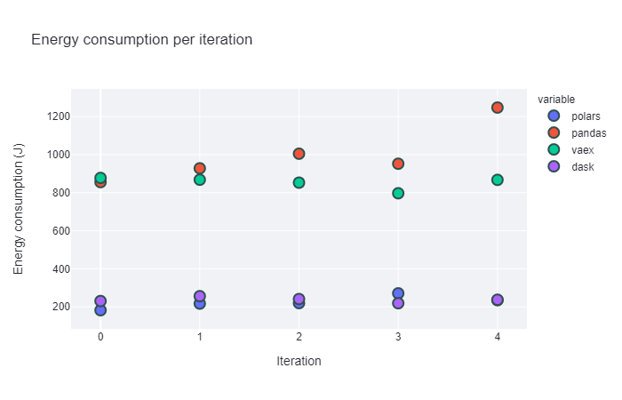
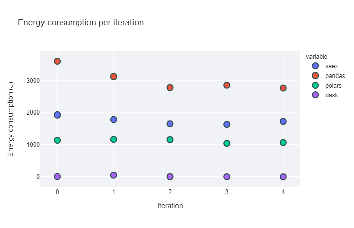
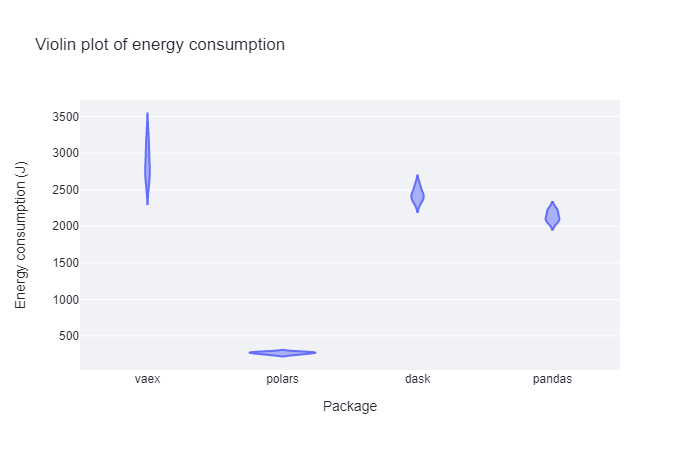

## Introduction
Data is everywhere and collected in large amounts by many services. They analyse this "Big Data" to better tailor their services and products to their customers. Software developers around the globe have to learn at least basic data analysis tools. Often, Python is used for this, as it is easy to use and has many accessible packages. Of course, some of these packages have distinct features, making choosing the one to use relatively easy. However, often the same result could be accomplished with multiple packages, and the choice is made based on personal preference, common practices online, or the developer's previous experience. 

Usually, environmental sustainability and energy consumption are not taken into account, even though this is becoming more and more relevant regarding climate change issues becoming more prominent. It is time for software developers to start thinking about the energy usage of their programs, since it has been estimated that, by 2040, the ICT sector will contribute to 14% of the global carbon footprint [1]. Therefore, in this report, we aim to compare the energy consumption of four popular data science libraries for Python. 

We will begin by introducing each library and discussing its strengths and weaknesses. Then, we will describe the methodology used to compare the energy consumption of each library. Finally, we will present the results of our comparison and draw conclusions about the energy efficiency of each library. Overall, this report aims to provide valuable insights into the energy consumption of popular data science libraries and how they can be used in a more sustainable way.

## Methodology

We have considered a few Python libraries for data analysis [2]. In the end we chose to evaluate only four: `pandas`, `polars`, `vaex`, and `dask`. These libraries are very often used and have some overlapping features, making a comparison more fair and relevant. We will focus on the following features in our comparison: 
* Group by
* Merge (join)
* Read and write

We will test these features on a large dataset, as these are common operations in data analysis and can be computationally intensive tasks. The motivation behind this comparison is to identify the most energy-efficient library to use for data analysis, with the ultimate goal of reducing carbon emissions. Therefore, it is important to model real-life scenarios with large-scale data analysis. 

### Libraries
#### Pandas
The most widely used DataFrame library is Pandas [3], and earlier research has been comparing this package against alternatives that might perform better on operations used on very large datasets [4]. The focus here is on speed and memory usage, but not on energy consumption. According to their website: "pandas aims to be the fundamental high-level building block for doing practical, real world data analysis in Python. Additionally, it has the broader goal of becoming the most powerful and flexible open source data analysis / manipulation tool available in any language." [5]

#### Polars
Polars is a DataFrame library and in-memory query engine. It focuses on speed and is described on the website as "lightning fast" [6]. It does this by making use of parallel execution and cache-efficient algorithms. It has been written in Rust, which is known for being a very quick and memory-efficient programming language. 

#### Dask
Dask is a parallel computing library for Python. It can be used to parallelize tasks from other Python libraries, such as pandas. Dask consists of two main components: Dynamic task scheduling optimized for computation, and Big Data collections like dataframes [7]. 

#### Vaex
Vaex is a python library for lazy Out-of-Core DataFrames and is similar to Pandas [8]. It is meant to visualize and explore big tabular datasets. It is meant for speed and advocates on its website that it can calculate statistics on an N-dimensional grid up to a billion rows per second. It achieves this by memory mapping, a zero memory copy policy, and lazy computations. 

Something that these four packages have in common is the fact that their main promise is speed. All four of them promise efficiency when running data analysis experiments. In some way, this can be beneficial to the energy usage, as the hardware resources are used optimally and thus need less energy. However, running the hardware at maximum capacity when that is not necessary is not preferred and actually bad for energy consumption. Therefore, we are going to measure energy consumption rather than speed, as that is a more reliable measure of true efficiency to us. 

### Dataset
In order to run the experiments we need a dataset to perform DataFrame operations on. For the experiments to show a possible difference between packages, the operations need to run a certain amount of time. Measuring the difference between one second operations would not be feasible with our setup. Therefore, we need a dataset that is large enough for the packages to somewhat struggle with the data, leading to longer operation times. However, we do not want the dataset to be too large because then operations will take too long and we will not be able to run enough iterations of the experiments. The [IMDB](https://imdb.com/) database is a well-known database that consists of movies, actors, directors, etc. Unfortunately, using the whole database was not possible because it would be too large and it consists of too many different relational tables. When looking for a suitable dataset within the database, we found the dataset of movies with some basic information about them. This dataset can be found [here](https://datasets.imdbws.com/) under the name: `title.basics.tsv.gz` and is approximately 1GB in size. We converted this dataset into a CSV format because it is a more used format and therefore gives us a more realistic experiment. More specifically, each item in this dataset contains the following:
- `tconst (string)` - alphanumeric unique identifier of the title
- `titleType (string)` – the type/format of the title (e.g. movie, short, tvseries, tvepisode, video, etc)
- `primaryTitle (string)` – the more popular title / the title - used by the filmmakers on promotional materials at the point of release
- `originalTitle (string)` - original title, in the original language
- `isAdult (boolean)` - 0: non-adult title; 1: adult title
- `startYear (YYYY)` – represents the release year of a title. In the case of TV Series, it is the series start year
- `endYear (YYYY)` – TV Series end year. ‘\N’ for all other title types
- `runtimeMinutes` – primary runtime of the title, in minutes
- `genres (string array)` – includes up to three genres associated with the title

For the merge experiment, however, we need two datasets to merge. To be able to do this we separated the dataset into two DataFrame each consisting of a unique id column and certain other columns with data. The separation is as the following:
- DataFrame 1: `['tconst', 'titleType', 'primaryTitle', 'originalTitle']`
- DataFrame 2: `['tconst', 'startYear' , 'endYear', 'runtimeMinutes', 'genres']`

### Roadmap
To run and analyse the three data operations using the four packages, we follow a systematic approach based on [research by Luís Cruz](https://luiscruz.github.io/2021/10/10/scientific-guide.html) [9]:

1) **Activate Zen mode** - Disable all background tasks and redundant applications, disable Bluetooth and WiFi, turn off notifications, do not use extra hardware, fix screen brightness, and prefer a cabled connection over wireless. This helps to get the measurements as stable as possible. This also means having a consistent room temperature throughout the measuring, in our case 21 degrees Celcius.
2) **Start PowerGadget log** - This creates a `.csv` log of power consumption.
3) **Run experiments** (automated 🤖)
    - 🔥 Warming up the machine - Running 5 minutes of CPU-intensive tasks for adequate hardware temperature. Since lower machine temperature will make sure that the first execution will appear more efficient, as the resistance of electrical conductors is lower when the temperature is lower. 
    - 🔀 Shuffled order - The experiments are shuffled, not in chronological order. External factors can change over time, influencing the results. Shuffling reduces the risk of bias and hidden errors in different versions. 
    - 🔁 Repeated 5 times - Each execution is repeated five times to form a distribution of samples. 
    - ⏯️ Wait 30 seconds between iterations - This reduces the effect of tail energy from previous runs.
    - ⌛ Measure start and stop time of each inner execution in `.csv`
4) **Stop PowerGadget log** - Saves the `.csv` log of power consumption.
5) **Calculate energy consumption** - By matching the timestamps of the `.csv` files, we can calculate the energy consumption for each iteration per package of an experiment.

For the documentation and code used to run, parse and visualize the experiments, we have created an open-source tool called [Carbonara](https://github.com/philippedeb/carbonara), which allows anyone to carry out similar experiments. It is a Windows tool to compare the energy consumption of Python code using Intel Power Gadget 3.6 as described in this methodology section. 

The machine on which we run the experiments is a plugged-in HP ZBook Studio G5 with the following specifications:
* **Processor**: Intel Core i7-8750H, Intel64, 2.2 GHz, 6 cores
* **RAM**: 16GB, DDR4
* **Display**: 15,6" size, 1920x1080 resolution, 100% brightness, IPS
* **GPU**: NVIDIA Quadro P1000, 4GB, Driver version 31.0.15.1669
 

## Results

### Groupby experiment

These two plots indicate that both polars and dask perform very well energy-usage-wise. They have a consistently lower energy usage when performing group-by operations than pandas and vaex. For the latter two, their averages are very similar, but the standard deviation of pandas seems to be much higher. The energy consumption is more unpredictable than it is for vaex. 

### Merge experiment

In the merge experiment, dask consistently has the lowest energy consumption, followed by polars, then vaex and pandas lastly. Notably, pandas again has a high standard deviation. 

### Read and write experiment

In the last operation, polars performed the best by far. Surprisingly, this time it is followed by pandas with remarkably lower standard deviation than in the previous examples. Dask performs similarly to pandas and vaex is the worst, also having the highest standard deviation. 

Due to the small number of iterations per feature, we decided not to perform any statistical tests. These tests are less accurate and less useful on small result sets. We can see some non-normal distributions in our current result, but we do not have enough data points to say if that is because of too few iterations or because of other reasons. Other reasons could include unusual tasks being run during execution or a change in external physical conditions. 

## Discussion
The results show that the maximum difference in these situations is 3000 joules, or 3 kJ. However, the average Dutch household uses around 2810 kWh per year, which amount to roughly 28 MJ per day [9]. Seeing as the average household in the Netherlands consists of 2.2 people [12], this means the average usage is 12.6 MJ per day per person. The difference that switching packages can maximally make is only 0.02% of the average daily usage. 

Every developer should determine for themselves if this difference would be worth it to them. Especially on smaller datasets, the time spent learning to use a new package might not be worth the effort as the difference it makes would be minimal. In that case, the extra time with the screen turned on would be less energy efficient than for example using pandas. 

### Limitations
Due to time constraints, the test setup has only been executed a few times. If we had multiple machines to run it on or had more time to run, the results probably would have been more accurate. However, running on multiple machines is not preferred, since the result may have varied per machine. Due to this small number of executions of the test setup, we also could not perform statistical tests. This means that we cannot determine if the results have a significant difference. 
Due to these time constraints, we only measured three operations. Of course, when performing real data analysis, often more operations are used. Therefore, further research is needed to conclude which package performs best in scenarios that resemble real-life situations better. 

### Future work
We have a few recommendations to continue this work and make it more relevant towards the end goal of finding out how to perform data analysis as energy-efficient as possible. 
First of all, this setup should be run multiple times to find out if the results are normally distributed, such that it can be determined how much it differs exactly. Furthermore, we would like to see the same setup begin used on different operations, more packages and different data sets. Running the operations on different machines, to see if that impacts the results would also be interesting. 
Lastly, finding out how long it takes software developers to learn to work with new software and comparing the energy usage of that with the difference in packages would be interesting. This way, we could find out if switching software would be worth the amount of screen time to learn to use it. 

## Conclusion
When taking energy consumption into account, it is always important to consider the operations that you will need and choose the best package based on that. However, if you don't have this information beforehand, we advise you to use polars, as it performed the best on average. 

However, since the difference is very small, we would advise only considering switching packages when these exact operations are used on a large dataset. For smaller datasets, the difference will be minimal and probably not worth the extra screen time of making the switch. 

## References
1. https://luiscruz.github.io/course_sustainableSE/2023/
2. https://towardsdatascience.com/8-alternatives-to-pandas-for-processing-large-datasets-928fc927b08c
3. https://ponder.io/pandas-is-now-as-popular-as-python-was-in-2016/
4. https://h2oai.github.io/db-benchmark/
5. https://pandas.pydata.org/about/
6. https://www.pola.rs/
7. https://www.dask.org/
8. https://vaex.io/docs/index.html
9. https://luiscruz.github.io/2021/10/10/scientific-guide.html
10. https://www.cbs.nl/nl-nl/cijfers/detail/81528NED
11. https://www.cbs.nl/nl-nl/nieuws/2021/31/8-miljoen-woningen-in-nederland
